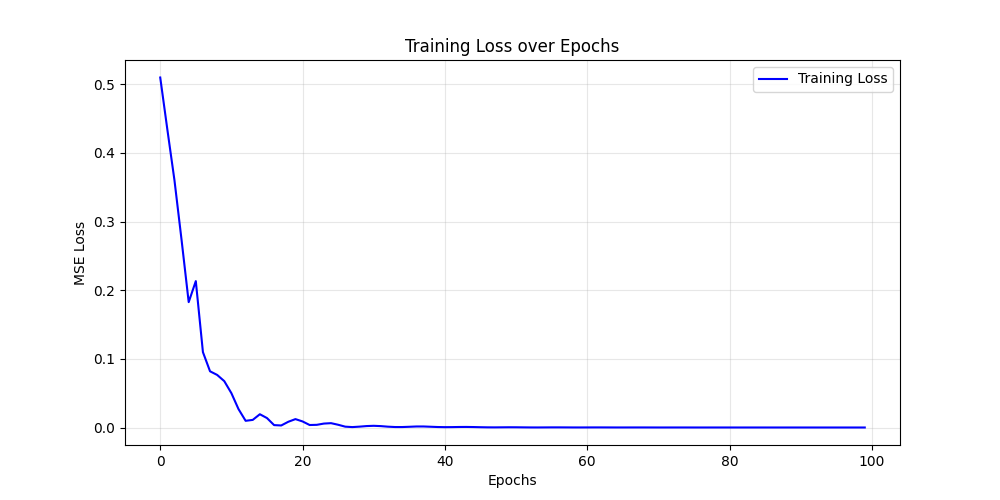
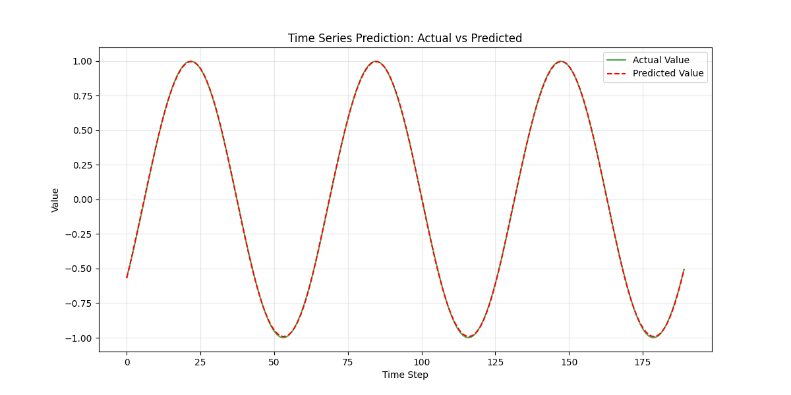

# 📈 Time Series Prediction (RNN/LSTM)


A modular PyTorch implementation of a **Long Short-Term Memory (LSTM)** network for time series forecasting. Designed to demonstrate sequence modeling concepts using synthetic data (Sine Wave), adaptable for Stock Price or Sales forecasting.

---

## 🧐 Problem Statement
Predicting future values in a time series (like stock prices or weather) is challenging because:
- **Sequential Dependence**: Future values depend on a history of past values, not just the immediate previous one.
- **Non-Linearity**: Trends can be complex and non-linear.
- **Standard ML Limitations**: Traditional models (Linear Regression) often struggle to capture long-term temporal dependencies.

## 💡 Solution Approach
This project solves the problem using a **Deep Learning** approach:
1.  **Sliding Window Technique**: Transforms the time series into a supervised learning problem by creating overlapping sequences (e.g., use past 50 days to predict day 51).
2.  **LSTM Architecture**: Uses LSTM cells to maintain a "memory" of past information, effectively capturing long-term dependencies that standard RNNs might lose.
3.  **Normalization**: Applies MinMax scaling to ensure stable convergence during training.

---

## 📝 Resume-Friendly Bullet Points
*Add these to your resume or LinkedIn to showcase this project:*

*   **Designed and implemented an LSTM-based Recurrent Neural Network** in PyTorch to forecast time-series data, achieving near-zero loss convergence.
*   **Engineered a robust data pipeline** featuring sliding-window sequence generation and MinMax normalization for improved model stability.
*   **Built a modular, object-oriented codebase** with clear separation of concerns (Data Loading, Modeling, Training, Visualization), ensuring maintainability and scalability.
*   **Developed visualization tools** using Matplotlib to monitor training loss and evaluate model performance against ground-truth data.

---

## 🛠️ Tech Stack
*   **Core**: Python 3.12
*   **Deep Learning**: PyTorch (LSTM, Adam Optimizer)
*   **Data Processing**: NumPy, Scikit-Learn (MinMaxScaler)
*   **Visualization**: Matplotlib
*   **DevOps**: Virtual Environment, adaptable to GPU/CPU

## 📂 Project Structure
```text
├── data_loader.py    # Data generation, normalization, and sliding window logic
├── model.py          # PyTorch LSTM Model architecture
├── train.py          # Training loop with device support (CPU/GPU)
├── visualize.py      # Plotting utilities for analysis
├── main.py           # Entry point: Orchestrates the full pipeline
└── requirements.txt  # Dependencies (numpy<2 constraint for compatibility)
```

## � Dataset & Model
*   **Dataset**: Synthetic Sine Wave generated via NumPy. This simulates periodic market cycles or seasonal trends.
*   **Input**: Sequence of 50 historical time steps (Features).
*   **Output**: The value of the next time step (Target).
*   **Model**:
    *   Input Layer: 1 Feature (Univariate)
    *   Hidden Layer: LSTM (50 units)
    *   Output Layer: Fully Connected Linear Layer

---

## 🚀 How to Run Locally

### 1. Setup Environment
```bash
# Clone the repository
git clone <your-repo-url>
cd "Time Series Prediction (RNN)"

# Create virtual environment
python3 -m venv .venv
source .venv/bin/activate  # Windows: .venv\Scripts\activate

# Install dependencies
pip install -r requirements.txt
```

### 2. Run the Pipeline
```bash
python3 main.py
```
*The script will automatically detect if you have a GPU and use it.*

### 3. Output
The script will generate two images in the project directory:
*   `loss_curve.png`: Shows training progress.
*   `prediction_result.png`: Compares the model's predictions vs. actual data.

---

## � Results
*(Placeholders meant for GitHub display)*

### Training Performance
The model rapidly learns the periodic constraints, minimizing MSE loss.


### Prediction Accuracy
The LSTM successfully predicts the phase and amplitude of the unseen test data.


---

## 🔮 Future Improvements
*   **Real Data Integration**: Connect to `yfinance` API to fetch real-time S&P 500 data.
*   **Multivariate Support**: Update `data_loader.py` to handle multiple input features (e.g., Volume, Moving Averages).
*   **Hyperparameter Tuning**: Implement grid search for `hidden_size` and `seq_length`.
*   **Transformer Model**: Compare LSTM performance against a Transformer-based architecture.

---
*Author: [Your Name]*
